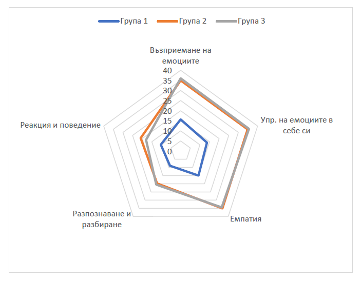
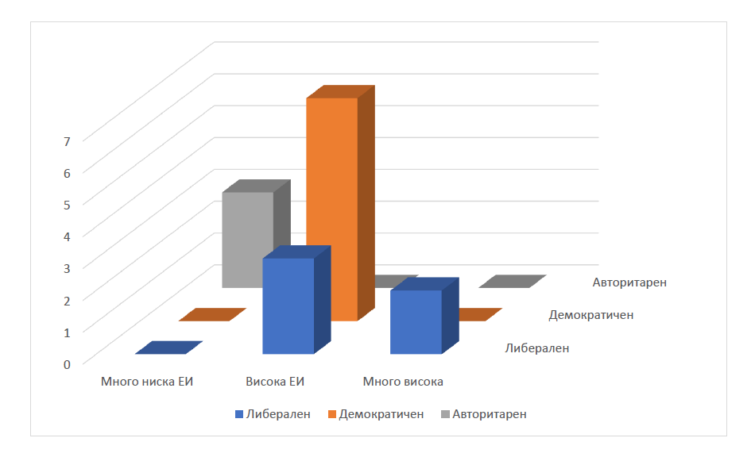

#### <!-- .element: class="main-title" --> Емоционалната интелигентност на лидерите  като фактор за ефективно управление   на конфликти в организациите
#### <!-- .element: class="main-subtitle" --> (по примера на Фаст Софтуер ООД)
#### <!-- .element: class="main-author" --> Дипломант **Яна Нейчева**, Магистър Бизнес психология

Note:

Увод: ЕИ ще бъде сред най-ценните умения в следващите години. Дори в контекста на Изкуствения Интелект, ЕИ е и ще остане човешкото умение за разбиране на емоциите (Голман, 2025). 

---

#### Цели на изследването

* <!-- .element: class="fragment" --> Нива на ЕИ 
* <!-- .element: class="fragment" --> Лидерски стил 
* <!-- .element: class="fragment" --> Подходи за упраление на конфликти
* <!-- .element: class="fragment" --> Положителна корелация ЕИ – лидерски стил – конфликтен мениджмънт

Note:
Връзката между нивата на ЕИ и предпочитаните лидерски стилове и подходи за управление на конфликти.

Положителни връзки между нивата на ЕИ, лидерските стилове и конфликтния мениджмънт.

Да проследи подходите за конфликтен ениджмънт

Да установи положителна корелация между ЕИ - Лидерски стил и конфл. мнгм

---

#### Методология на изследването

* <!-- .element: class="fragment" --> Въпросник за нивата на ЕИ у лидерите
  
* <!-- .element: class="fragment" --> Въпросник за стилове на управление на конфликти
  
* <!-- .element: class="fragment" --> Въпросник за стилове на лидерство

Note:
Изследването се осъществява посредством три въпросника.

1.	ЕИ по метода на Голман – ESI (Goleman, 2000). Състои се от 25 айтема, обследва 5те основни компонента на ЕИ. 
2.	управление на конфликти по методиката на Томас-Килман – Thomas-Kilmann Conflict Mode Instrument, TKI. Състои се от 30 въпроса, по 5 въпроса за всеки стил на управление.
3.	Въпросникът за стилове на лидерство се състои от 16 въпроса, обследващ трите най-често прилагани стилове лидерство.

---

#### Хипотези на изследването

----

Високо ниво на ЕИ = демократичен лидерски стил.

  
Note:
Допуска се, че респондентите с високо ниво на емоционална интелигентност предпочитат демократичен лидерски стил.

----
  
По-ниски нива на ЕИ = авторитарен стил на управление.

  Note:
  Предполага се, че лидерите с по-ниски нива на емоционална интелигентност по-често прилагат авторитарен стил на управление.
  
----

Положителна връзка между нивото на ЕИ и склонността към използване на сътрудничество при управление на конфликти.

Note:
Допуска се, че съществува положителна връзка между нивото на емоционална интелигентност и склонността към използване на сътрудничество при управление на конфликти.

----
  
По-силна емпатия води до избягване на конфронтационни и агресивни подходи в конфликти.

Note:
Предполага се, че лидери, проявяващи по-силна емпатия (като компонент на ЕИ), избягват конфронтационни и агресивни подходи в конфликти.

---

#### Резултати от изследването

----

|Група|ЕИ ниво|Конфликтно управление|Лидерски стил|Стил на управление на конфликти|
|--|--|--|--|--|
|Група 1|Много ниска|Ниско/Средно|Авторитарен|Съперничество/Избягване|
|Група 2|Висока|Добро|Демократичен/Либерален|Сътрудничество/Компромис/Приспособяване|
|Група 3|Много висока|Добро|Либерален|Сътрудничество/Компромис|

Note:
Обобщение на основните зависимости между групите изследвани лица по нива на ЕИ, стил на управление на конфликти и стил на лидерство и стил на управление на конфликти
Хипотеза 1:
ЕИ е директно свързана с начина на конфликтно управление и стила лидерство. Авторитарният стил се наблюдава при ниска ЕИ. Демократичният и Либералният стил се наблюдават при високи нива на ЕИ с добри умения за регулация на конфликтите. С тези изводи се подкрепя Хипотеза 1.

хипотеза 3:
Високото ниво на ЕИ и склонността към използване на сътрудничество при управление на конфликти са положително свързани, което подкрепя Хипотеза 3.

----

|Лидер|Стил на управление на конфликти|Ниво на управление|Ниво на ЕИ|Стил на лидество|
|--|--|--|--|--|
|ИЛ 1|Съперничество|Ниско|Много ниска|Авторитарен|
|ИЛ 5|Избягване|Средно|Много ниска|Авторитарен|
|ИЛ 10|Съперничество|Средно|Много ниска|Авторитарен|

Note:
Извадка на ИЛ с Авторитарен стил на лидерство

Хипотеза 2:
Хипотеза 2, която гласи, че лидерите с по-ниски нива на ЕИ по-често прилагат авторитарен стил на управление. Резултатите показват 3 ИЛ с ниска ЕИ и авторитарно лидерство. 
Препочитаният стил на управление на конфликти е Съперничество и Избягване. 

----

Note:

Предполага се, че лидери, проявяващи по-силна емпатия (като компонент на ЕИ), избягват конфронтационни и агресивни подходи в конфликти.
Хипотеза 4 се потвърждава със следните резултати:
- Група 2 е с високи стойности
- показват умения да разбират емоциите си, с добра социална сензитивност и адекватно поведението при конфликти.
- Емпатията е на високо ниво, стабилност и висока социална и емоционална компетентност.

- Група 3 показва много високи нива на ЕИ, но с лека асиметрия при разпознаването, разбирането и реакциите при конфликти. Групата има отлична вътрешна осъзнатост и саморегулация, но вероятно по-слаба външна демонстрация на емоциите.

----

Note:

Основно се наблюдава комбинация между високо ниво на ЕИ с Демократичен стил на лидерство и Сътрудничество като предпочитан стил на управление на конфликти.

---

#### Практически препоръки

* <!-- .element: class="fragment" --> Развитие на ЕИ
* <!-- .element: class="fragment" --> Комуникативни умения
* <!-- .element: class="fragment" --> Стратегии за управление на конфликти
* <!-- .element: class="fragment" --> Организационна интеграция
* <!-- .element: class="fragment" --> Култура на учеща организация

Note:

Високите нива на ЕИ имат пряко влияние върху уменията на лидерите за ефективно управление на конфликти. Основни препоръки:

1. Развитие на ЕИ - обучения, тренинги
- 360 градусова обратна връзка
- Коучинг

2. Развитие на Комуникативните умения

3. Да се изгради Стратегия за упр. конф

4. Организационна интеграция - процес за ранна идентификация на конф., обучение на таргетиран персонал за упр. на конфл, интеграция на ЕИ към лидерските профили

5. Постоянно обучение и споделяне на знание
---

#### Разграничаване на демократичния от либералния стил на практика в контекста на управление на конфликти

----

#### Либерален лидер

* <!-- .element: class="fragment" --> Максимална автономия на екипа
* <!-- .element: class="fragment" --> Минимална намеса в процесите
* <!-- .element: class="fragment" --> Свобода на служителите да разрешават конфликти

----

#### Конфликтен мениджмънт (Либерален лидер)

* <!-- .element: class="fragment" --> Минимална намеса при конфликт
* <!-- .element: class="fragment" --> Делегира отговорности
* <!-- .element: class="fragment" --> Насърчава автономия и саморегулация
* <!-- .element: class="fragment" --> Високо-компетентни и зрели екипи
* <!-- .element: class="fragment" --> Риск от ескалация

----

#### Демократичен лидер

* <!-- .element: class="fragment" --> Активно участие при вземане на решения
* <!-- .element: class="fragment" --> Прозрачност, открита комуникация, колективна отговорност
* <!-- .element: class="fragment" --> Цени мненията, стремеж към консенсус

----

#### Конфликтен мениджмънт (Демократичен лидер)

* <!-- .element: class="fragment" --> Активно слушане
* <!-- .element: class="fragment" --> Модериране на дискусията
* <!-- .element: class="fragment" --> Колективно решение
* <!-- .element: class="fragment" --> Повишена ангажираност
* <!-- .element: class="fragment" --> Минимален риск от ескалация

---

#### Ако имахте възможност да разширите изследването към други икономически сектори, какви методи бихте използвали, за да адаптирате инструментариума?		

----
* Анализ на сектора
* <!-- .element: class="fragment" --> Адаптиране на тестовете
* <!-- .element: class="fragment" --> Пилотно изследване
* <!-- .element: class="fragment" --> Фокус групи

Note:

Пилотно изследване - Проверка на разбираемостта на въпросите.
Анализ на вътрешната консистентност (Cronbach’s Alpha).
Валидиране чрез сравнение с известни резултати от предишни изследвания.

Фокус групи - За проверка дали инструментариумът отразява реалните предизвикателства.

---

#### Какви мерки бихте препоръчали за минимизиране на субективността при самооценъчните въпросници и как това би повлияло върху валидността на резултатите?		

----

* Смесени методи за събиране на данни
* <!-- .element: class="fragment" --> 360 градусова обратна връзка
* <!-- .element: class="fragment" --> Индиректни формулировки
* <!-- .element: class="fragment" --> Отрицателно формулирани твърдения

Note:
Освен приложените контролни въпроси за избягване на социалната желателност при отговорите, както и анонимността на респондентите, допълнителни методи биха били:
- Смесени - наблюдение на поведението в реална и симулирана среда
- 360 градусова обратна връзка
- Индиректни формулировки - Формулиране на въпросите така, че да намалят прозиращите „желани“ отговори (например вместо „Смятам се за лидер“, се пита „Колко често другите търсят вашето мнение при вземане на решения?“).
-  Отрицателно формулирани твърдения - за да се избегне автоматично маркиране на отговори

---

#### Благодаря за вниманието!

